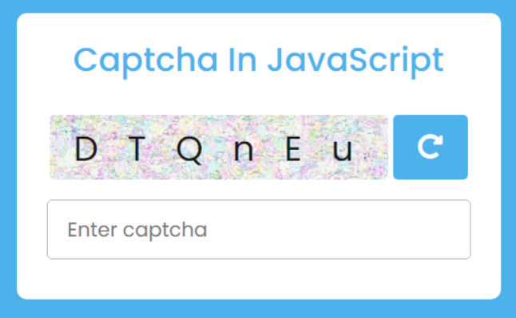
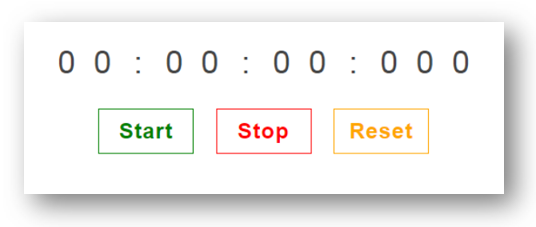

# JavaScript Program Writing

<br/>

## Q. Write a program to swap two string variables without using temp variable?

```js
Input: a = 'Hello', b = 'World'
Output: a = 'World', b = 'Hello'
```

<details><summary><b>Answer</b></summary>

**Solution 01:** ES6 only

```js
let [a, b] = ["Hello", "World"];

[b, a] = [a, b]; // Swap variables

console.log(a, b); // World Hello
```

**Solution 02:** ES5 compatible

```js
/**
 * 1. a = b assigns the old value of b to a and yelds it, therefore [a, a=b] will be [a, b]
 * 2. the [0] operator yelds the first element of the array, which is a, so now b = [a,b][0] turns * into b = a
 */
var a = "World";
var b = "Hello";

b = [a, (a = b)][0];

console.log(a, b); // Hello World
```

</details>

<div align="right">
    <b><a href="#javascript-coding-practice">↥ back to top</a></b>
</div>

## Q. Find the missing number in an array?

```js
Input: [1, 6]
Output: 2, 3, 4, 5

Input: [1, 2, 10]
Output: 3, 4, 5, 6, 7, 8, 9

Input: [-1, -2, 3]
Output: 2, 3, 4, 5
```

<details><summary><b>Answer</b></summary>

```js
const findMissing = (arr) => {
  const missing = [];
  const max = Math.max(...arr); // highest number
  const min = Math.min(...arr); // lowest number

  for (let i = min; i <= max; i++) {
    if (!arr.includes(i)) {
      missing.push(i); // Adding numbers which are not in array
    }
  }
  return missing;
};

console.log(findMissing([1, 6]));
```

</details>

<div align="right">
    <b><a href="#javascript-coding-practice">↥ back to top</a></b>
</div>

## Q. Write a function to count number of elements in nested array?

```js
Input: [1, [2, [3, [4, [5, 6]]]]]
Output: 6
```

<details><summary><b>Answer</b></summary>

```js
let count = 0;

function nestedCount(arr) {
  arr.forEach((val) => {
    if (Array.isArray(val)) {
      nestedCount(val);
    } else {
      count++;
    }
  });
  return count;
}

let input = [1, [2, [3, [4, [5, 6]]]]];

console.log(nestedCount(input)); // 6
```

</details>

<div align="right">
    <b><a href="#javascript-coding-practice">↥ back to top</a></b>
</div>

## Q. Write a function to return below details?

```js
const characters = [
  {
    name: "Luke Skywalker",
    height: "172",
    mass: "77",
    eye_color: "blue",
    gender: "male",
  },
  {
    name: "Darth Vader",
    height: "202",
    mass: "136",
    eye_color: "yellow",
    gender: "male",
  },
  {
    name: "Leia Organa",
    height: "150",
    mass: "49",
    eye_color: "brown",
    gender: "female",
  },
  {
    name: "Anakin Skywalker",
    height: "188",
    mass: "84",
    eye_color: "blue",
    gender: "male",
  },
];
```

**1. MAP:**

* Get an array of all names
* Get an array of all heights
* Get an array of objects with just name and height properties
* Get an array of all first names

<details><summary><b>Answer</b></summary>

```js
// Get an array of all names
const names = characters.map((character) => {
  return character.name;
});
console.log(names);
```

```js
// Get an array of all heights
const heights = characters.map((character) => {
  return character.height;
});
console.log(heights);
```

```js
// Get an array of objects with just name and height properties
const objects = characters.map((character) => {
  return { name: character.name, height: character.height };
});
console.log(objects);
```

```js
// Get an array of all first names
const firstNames = characters.map((character) => {
  return character.name.split(" ")[0];
});
console.log(firstNames);
```

</details>

<div align="right">
    <b><a href="#javascript-coding-practice">↥ back to top</a></b>
</div>

**2. REDUCE:**

* Get the total mass of all characters
* Get the total height of all characters
* Get the total number of characters in all the character names
* Get the total number of characters by eye color (hint. a map of eye color to count)

<details><summary><b>Answer</b></summary>

```js
// Get the total mass of all characters
const totalMass = characters.reduce((sum, character) => {
  return sum + parseInt(character.mass);
}, 0);
console.log(totalMass);
```

```js
// Get the total height of all characters
const totalHeight = characters.reduce((sum, character) => {
  return sum + parseInt(character.height);
}, 0);
console.log(totalHeight);
```

```js
// Get the total number of characters in all the character names
const characterCountByName = characters.reduce((result, character) => {
  if (typeof result[character.name] === "undefined") {
    result[character.name] = 1;
  } else {
    result[character.name] += 1;
  }

  return result;
}, {});
console.log(characterCountByName);
```

```js
// Get the total number of characters by eye color
const characterCountByEyeColor = characters.reduce((result, character) => {
  if (typeof result[character.eye_color] === "undefined") {
    result[character.eye_color] = 1;
  } else {
    result[character.eye_color] += 1;
  }

  return result;
}, {});
console.log(characterCountByEyeColor);
```

</details>

<div align="right">
    <b><a href="#javascript-coding-practice">↥ back to top</a></b>
</div>

**3. FILTER:**

* Get characters with mass greater than 100
* Get characters with height less than 200
* Get all male characters
* Get all female characters

<details><summary><b>Answer</b></summary>

```js
// Get characters with mass greater than 100
const characterMass = characters.filter((character) => {
  return character.mass > 100;
}, {});
console.log(characterMass);
```

```js
// Get characters with height less than 200
const characterHeight = characters.filter((character) => {
  return character.height < 200;
}, {});
console.log(characterHeight);
```

```js
// Get all male characters
const characterMale = characters.filter((character) => {
  return character.gender === 'male';
}, {});
console.log(characterMale);
```

```js
// Get all female characters
const characterFemale = characters.filter((character) => {
  return character.gender === 'female';
}, {});
console.log(characterFemale);
```

</details>

<div align="right">
    <b><a href="#javascript-coding-practice">↥ back to top</a></b>
</div>

**4. SORT:**

* Sort by name
* Sort by mass
* Sort by height
* Sort by gender

<details><summary><b>Answer</b></summary>

```js
// Sort by Name
const sortByName = characters.sort((a, b) => {
  if (a.name < b.name) {
    return -1;
  }
});
console.log(sortByName);
```

```js
// Sort by Mass
const sortByMass = characters.sort((a, b) => {
  if (parseInt(a.mass) < parseInt(b.mass)) {
    return -1;
  }
});
console.log(sortByMass);
```

```js
// Sort by Height
const sortByHeight = characters.sort((a, b) => {
  if (parseInt(a.height) < parseInt(b.height)) {
    return -1;
  }
});
console.log(sortByHeight);
```

```js
// Sort by Gender
const sortByGender = characters.sort((a, b) => {
  if (a.gender < b.gender) {
    return -1;
  }
});
console.log(sortByGender);
```

</details>

<div align="right">
    <b><a href="#javascript-coding-practice">↥ back to top</a></b>
</div>

**5. EVERY:**

* Does every character have blue eyes?
* Does every character have mass more than 40?
* Is every character shorter than 200?
* Is every character male?

<details><summary><b>Answer</b></summary>

```js
// Does every character have blue eyes
const checkBlueEye = characters.every(
  (character) => character.eye_color === "blue"
);
console.log(checkBlueEye);
```

```js
// Does every character have mass more than 40
const checkMass = characters.every((character) => character.mass > 40);
console.log(checkMass);
```

```js
// Is every character shorter than 200
const checkHeight = characters.every((character) => character.height < 200);
console.log(checkHeight);
```

```js
// Is every character Male
const checkGender = characters.every(
  (character) => character.gender === "male"
);
console.log(checkGender);
```

</details>

<div align="right">
    <b><a href="#javascript-coding-practice">↥ back to top</a></b>
</div>

**6. SOME:**

* Is there at least one male character?
* Is there at least one character with blue eyes?
* Is there at least one character taller than 200?
* Is there at least one character that has mass less than 50?

<details><summary><b>Answer</b></summary>

```js
// Is there at least one male character
const checkGender = characters.some(
  (character) => character.gender === "male"
);
console.log(checkGender);
```

```js
// Is there at least one character with blue eyes
const checkEye = characters.some(
  (character) => character.eye_color === "blue"
);
console.log(checkEye);
```

```js
// Is there at least one character taller than 200
const checkHeight = characters.some(
  (character) => character.height > 200
);
console.log(checkHeight);
```

```js
// Is there at least one character that has mass less than 50
const checkMass = characters.some(
  (character) => character.mass < 50
);
console.log(checkMass);
```

</details>

<div align="right">
    <b><a href="#javascript-coding-practice">↥ back to top</a></b>
</div>

## Q. Replace first two elements in array using splice()?

**Examples:**

```js
Input: ["Angular", "JavaScript", "NodeJS", "MongoDB"];
Output: ["React", "Redux", "NodeJS", "MongoDB"];
```

<details><summary><b>Answer</b></summary>

```js
let arr = ["Angular", "JavaScript", "NodeJS", "MongoDB"];

arr.splice(0, 2, "React", "Redux");
console.log(arr);
```

</details>

<div align="right">
    <b><a href="#javascript-coding-practice">↥ back to top</a></b>
</div>

## Q. Write a function to check whether given string is a Palindrome or not?

**Examples:**

```js
Input: "aba"
Output: "Palindrome"

Input: "ABCDCBA"
Output: "Palindrome"

Input: "Hello"
Output: "Not a Palindrome"
```

<details><summary><b>Answer</b></summary>

```js
function checkPalindrome(str) {
  for (let i = 0; i < str.length / 2; i++) {
    // check if first and last character are same
    if (str[i] !== str[str.length - 1 - i]) {
      return "Not a palindrome";
    }
  }
  return "Palindrome";
}

console.log(checkPalindrome("aba"));
console.log(checkPalindrome("ABCDCBA"));
console.log(checkPalindrome("Hello"));
```

</details>

<div align="right">
    <b><a href="#javascript-coding-practice">↥ back to top</a></b>
</div>

## Q. Write a function to find out number of occurrences of a character in a given string?

**Examples:**

```js
Input: 'm', 'how many times does the character occur in this sentence?'
Output: 2

Input: 'h', 'how many times does the character occur in this sentence?'
Output: 4

Input: '?', 'how many times does the character occur in this sentence?'
Output: 1
```

<details><summary><b>Answer</b></summary>

**Solution 01:** Using for Loop

```js
function countCharacter(str, ch) {
  let count = 0;
  for (let i = 0; i < str.length; i++) {
    // check if the character is at that position
    if (str.charAt(i) === ch) {
      count += 1;
    }
  }
  return count;
}

console.log(countCharacter(str, ch));
```

**Solution 02:** Using Regex

```js
function countCharacter(str, ch) {
  // creating a pattern
  const re = new RegExp(ch, "g");
  return str.match(re).length;
}

console.log(countCharacter(str, ch));
```

**Solution 03:** Using split() function

```js
function countCharacter(str, ch) {
  return str.split(ch).length - 1;
}

console.log(countCharacter(str, ch));
```

**Solution 04:** Using filter() function

```js
function countCharacter(str, ch) {
  return [...str].filter((x) => x === ch).length;
}

console.log(countCharacter(str, ch));
```

</details>

<div align="right">
    <b><a href="#javascript-coding-practice">↥ back to top</a></b>
</div>

## Q. Write a function that takes a string as argument and increment each letter to the next letter in the alphabet?

**Examples:**

```js
Input: 'aaa'
Output: 'bbb'

Input: 'abcde'
Output: 'bcdef'

Input: 'hello'
Output: 'ifmmp'
```

<details><summary><b>Answer</b></summary>

```js
function nextChar(c) {
  return String.fromCharCode(c.charCodeAt(0) + 1);
}

const transform = (str) => {
  let word = "";
  for (let i = 0; i < str.length; i++) {
    word += nextChar(str[i]);
  }
  return word;
};

const input = "aaa";
console.log(transform(input)); // bbb
```

</details>

<div align="right">
    <b><a href="#javascript-coding-practice">↥ back to top</a></b>
</div>

## Q. Write a function that takes a string as argument and remove the first 'n' characters from it?

**Examples:**

```js
Input: 'Hello World', 6
Output: 'World'

Input: '12345', 2
Output: '345'

Input: 'JavaScript', 4
Output: 'Script'
```

<details><summary><b>Answer</b></summary>

**Solution 01:** Using substring() method

```js
function transform(str, n) {
  return str.substring(n);
}

console.log(transform("Hello World", 6));
```

**Solution 02:** Using slice() method

```js
function transform(str, n) {
  return str.slice(n);
}

console.log(transform("Hello World", 6));
```

**Solution 03:** Using substr() method

```js
function transform(str, n) {
  return str.substr(n);
}

console.log(transform("Hello World", 6));
```

</details>

<div align="right">
    <b><a href="#javascript-coding-practice">↥ back to top</a></b>
</div>

## Q. Write a function to transform string array into group by its length?

**Examples:**

```js
Input: ['one', 'two', 'three'] 
Output: {3: ["one", "two"], 5: ["three"]}
```

<details><summary><b>Answer</b></summary>

```js
const result = {};

for (let elemement of arr) {
  if (!(elemement.length in result)) {
    result[elemement.length] = [];
  }
  result[elemement.length].push(elemement);
}

console.log(result);
```

</details>

<div align="right">
    <b><a href="#javascript-coding-practice">↥ back to top</a></b>
</div>

## Q. Write a function to transform json in group by parameter?

**Examples:**

```js
[ 
    { Phase: "Phase 1", Step: "Step 1", Task: "Task 1", Value: "5"},
    { Phase: "Phase 1", Step: "Step 1", Task: "Task 2", Value: "10"},
    { Phase: "Phase 1", Step: "Step 2", Task: "Task 1", Value: "15"},
    { Phase: "Phase 1", Step: "Step 2", Task: "Task 2", Value: "20"},
    { Phase: "Phase 2", Step: "Step 1", Task: "Task 1", Value: "25"},
    { Phase: "Phase 2", Step: "Step 1", Task: "Task 2", Value: "30"}
];

// Output: Group By 'Phase'
{
  'Phase 1': [
    { Phase: 'Phase 1', Step: 'Step 1', Task: 'Task 1', Value: '5' },
    { Phase: 'Phase 1', Step: 'Step 1', Task: 'Task 2', Value: '10' },
    { Phase: 'Phase 1', Step: 'Step 2', Task: 'Task 1', Value: '15' },
    { Phase: 'Phase 1', Step: 'Step 2', Task: 'Task 2', Value: '20' }
  ],
  'Phase 2': [
    { Phase: 'Phase 2', Step: 'Step 1', Task: 'Task 1', Value: '25' },
    { Phase: 'Phase 2', Step: 'Step 1', Task: 'Task 2', Value: '30' }
  ]
}
```

<details><summary><b>Answer</b></summary>

```js
const groupBy = function (items, key) {
  return items.reduce(function (result, item) {
    (result[item[key]] = result[item[key]] || []).push(item);
    return result;
  }, {});
};

console.log(groupBy(arry, "Phase"));
```

</details>

<div align="right">
    <b><a href="#javascript-coding-practice">↥ back to top</a></b>
</div>

## Q. Write a function to transform json in group by id?

**Examples:**

```js
Input:

[
  { id: 1, type: "ADD" },
  { id: 1, type: "CHANGE" },
  { id: 2, type: "ADD" },
  { id: 3, type: "ADD" },
  { id: 3, type: "CHANGE" },
  { id: 2, type: "REMOVE" },
  { id: 3, type: "CHANGE" },
  { id: 1, type: "REMOVE" },
];

Output:

[
  { id: 1, type: ["ADD", "CHANGE", "REMOVE"] },
  { id: 2, type: ["ADD", "REMOVE"] },
  { id: 3, type: ["ADD", "CHANGE", "CHANGE"] },
];
```

<details><summary><b>Answer</b></summary>

```js
const groupBy = (arr = []) => {
   const result = [];
   const map = {};
   for (let i = 0, j = arr.length; i < j; i++) {
      let element = arr[i];
      if (!(element.id in map)) {
         map[element.id] = {id: element.id, type: []};
         result.push(map[element.id]);
      };
      map[element.id].type.push(element.type);
   };
   return result;
};

console.log(groupBy(arr));
```

</details>

<div align="right">
    <b><a href="#javascript-coding-practice">↥ back to top</a></b>
</div>

## Q. Write a function to implement Math.pow() function?

**Input: (2)<sup>3</sup>**  
**Output: 8**

<details><summary><b>Answer</b></summary>

```js
function powerOf(base, exponent) {
  let result = 1;
  for (let i = 1; i <= exponent; i++) {
    result = result * base;
  }
  return result;
}

console.log(powerOf(2, 3));
```

</details>

<div align="right">
    <b><a href="#javascript-coding-practice">↥ back to top</a></b>
</div>

## Q. Write a function to remove duplicates from an integer array in JavaScript?

```js
Input: [3, 2, 4, 5, 8, 9, 3, 8, 1, 7, 8, 4, 3, 2]
Output: [1, 2, 3, 4, 5, 7, 8, 9]
```

<details><summary><b>Answer</b></summary>

```js
function removeDuplicates(arr) {
  let result = [];
  arr.forEach((element) => {
    if (!result.includes(element)) {
      result.push(element);
    }
  });
  return result;
}

console.log(removeDuplicates(arr));
```

</details>

<div align="right">
    <b><a href="#javascript-coding-practice">↥ back to top</a></b>
</div>

## Q. Write a function to find non-repetitive numbers in a given array?

**Examples:**

```js
Input:
[2, 3, 4, 3, 3, 2, 4, 9, 1, 2, 5, 5]

Output:
[9, 1]
```

<details><summary><b>Answer</b></summary>

```js
// Creating Object with number of occurance of each elements
const count = {};
for(let element of arr) {
   if(count[element]) {
      count[element] += 1;
   } else {
      count[element] = 1;
   }
}

// Iterate Unique elements
for(let key in count) {
    if(count[key] === 1) {
       console.log(key + '->' + count[key]); 
    }
}
```

</details>

<div align="right">
    <b><a href="#javascript-coding-practice">↥ back to top</a></b>
</div>

## Q. Write a function to accept string and find first non-repeated character?

**Examples:**

```js
Input: 'aabcbd'
Output: 'c'

Input: 'teeter'
Output: 'r'

Input: 'abacddbec'
Output: 'e'
```

<details><summary><b>Answer</b></summary>

```js
function firstNonRepeatingCharacter(str) {
  for (let i = 0; i < str.length; i++) {
    let char = str[i];
    if (str.indexOf(char) === str.lastIndexOf(char)) {
      return char;
    }
  }
  return "_";
}

console.log(firstNonRepeatingCharacter("aabcbd")); // c

console.log(firstNonRepeatingCharacter("teeter")); // r

console.log(firstNonRepeatingCharacter("abacddbec")); // e

```

</details>

<div align="right">
    <b><a href="#javascript-coding-practice">↥ back to top</a></b>
</div>

## Q. Write a function to sort an integer array?

**Examples:**

```js
Input: [ 53, 11, 34, 12, 18 ]
Output: [ 11, 12, 18, 34, 53 ];
```

<details><summary><b>Answer</b></summary>

**Solution 1:**

```js
/**
 * Sort elements using compare method
 */
let arr = [53, 11, 34, 12, 18];

arr.sort((a, b) => {
  return a - b;
});

console.log(arr);
```

**Solution 2:**

```js
/**
 * Optimized implementation of bubble sort Algorithm
 */
function bubbleSort(arr) {
  let isSwapped = false;

  for (let i = 0; i < arr.length; i++) {
    isSwapped = false;

    for (let j = 0; j < arr.length; j++) {
      if (arr[j] > arr[j + 1]) {
        let temp = arr[j];
        arr[j] = arr[j + 1];
        arr[j + 1] = temp;
        isSwapped = true;
      }
    }

    // If no two elements were swapped by inner loop, then break
    if (!isSwapped) {
      break;
    }
  }
  return arr;
}

console.log(bubbleSort([53, 11, 34, 12, 18]));
```

</details>

<div align="right">
    <b><a href="#javascript-coding-practice">↥ back to top</a></b>
</div>

## Q. Write a program to read file and count word, unique word and search string?

**Examples:**

```js
Input: file.txt
Search String: 'Lipsum'
Output: 
┌──────────────┬────────┐
│   (index)    │ Values │
├──────────────┼────────┤
│  Word Count  │   22   │
│ Unique Words │   17   │
│ searchString │   18   │
└──────────────┴────────┘
```

<details><summary><b>Answer</b></summary>

```js
const fs = require("fs");

// #1 count the number of words
const wordCount = (string) => string.split(" ").length;

// #2 count the number of unique words
const uniqueWords = (txt) => new Set(txt.toLowerCase().match(/\w+/g)).size;

// #3 count the search string
const searchString = (string) => {
  let count = 0;
  let words = string.split(" ");

  for (let i = 0; i < words.length; i++) {
    if (words[i].indexOf("ispsum")) {
      count++;
    }
  }
  return count;
};

fs.readFile("file.txt", "utf8", function (err, data) {
  if (err) throw err;
  console.log("The text in the file:\n\n", data, "\n");
  // store results in an object to present the log better
  let result = {
    "Word Count": wordCount(data),
    "Unique Words": uniqueWords(data),
    searchString: searchString(data),
  };
  console.table(result);
});
```

</details>

<div align="right">
    <b><a href="#javascript-coding-practice">↥ back to top</a></b>
</div>

## Q. Find the most repeated elements in given array?

**Examples:**

```js
Input: [1, 2, 3, 4, 5, 1]
Output: [1, 2]

Input: [12, 5, 6, 76, 23, 12, 34, 5, 23, 34, 65, 34, 22, 67, 34]
Output: [34, 4]

Input:  [2, 1, 10, 7, 10, 3, 10, 8, 7, 3, 10, 5, 4, 6, 7, 9, 9, 9, 9, 6, 3, 7, 6, 9, 8, 9, 10]
Output: [9, 6]
```

<details><summary><b>Answer</b></summary>

```js
function mostFrequentElement(array) {
  let count = {};
  let maxElement = array[0];
  let maxCount = 1;

  for (let i = 0; i < array.length; i++) {
    let element = array[i];
    if (count[element]) {
      count[element] += 1;
    } else {
      count[element] = 1;
    }
    if (count[element] > maxCount) {
      maxElement = element;
      maxCount = count[element];
    }
  }
  return [maxElement, maxCount];
}

console.log(mostFrequentElement([12, 5, 6, 76, 23, 12, 34, 5, 23, 34, 65, 34, 22, 67, 34])); // [34, 4]
```

</details>

<div align="right">
    <b><a href="#javascript-coding-practice">↥ back to top</a></b>
</div>

## Q. Filter users with age between 15 and 30 from the given json array?

**Examples:**

```js
Input: 
[
  {
    a: { name: "John", age: 25 },
    b: { name: "Peter", age: 45 },
    c: { name: "Bob", age: 20 },
  },
  {
    a: { name: "Ram", age: 25 },
    b: { name: "Krish", age: 45 },
    c: { name: "Roshan", age: 20 },
  },
];

Output:
[
  [ { name: 'John', age: 25 }, { name: 'Bob', age: 20 } ], 
  [ { name: 'Ram', age: 25 }, { name: 'Roshan', age: 20 } ]
]
```

<details><summary><b>Answer</b></summary>

```js
function filterUser(arr) {
  const users = [];

  for (let i = 0; i < arr.length; i++) {
    let element = arr[i];
    let user = Object.values(element).filter((key) => {
      return key.age > 15 && key.age < 30;
    });
    users.push(user);
  }
  return users;
}
```

</details>

<div align="right">
    <b><a href="#javascript-coding-practice">↥ back to top</a></b>
</div>

## Q. Write a function to accept argument like `sum(num1)(num2);` or `sum(num1,num2);`

**Examples:**

```js
Input: sum(10)(20);
Output: 30
Explanation: 10 + 20 = 30

Input: sum(10, 20);
Output: 30
Explanation: 10 + 20 = 30
```

<details><summary><b>Answer</b></summary>

```js
function sum(x, y) {
  if (y !== undefined) {
    return x + y;
  } else {
    return function (y) {
      return x + y;
    };
  }
}

console.log(sum(10, 20));
console.log(sum(10)(20));
```

**&#9885; [Try this example on CodeSandbox](https://codesandbox.io/s/js-cp-1-ypmjhl?file=/src/index.js)**

</details>

<div align="right">
    <b><a href="#javascript-coding-practice">↥ back to top</a></b>
</div>

## Q. Write a function to get the difference between two arrays?

**Example:**

```js
Input:
['a', 'b'];
['a', 'b', 'c', 'd'];

Output:
["c", "d"]
```

<details><summary><b>Answer</b></summary>

```js
let arr1 = ['a', 'b'];
let arr2 = ['a', 'b', 'c', 'd'];

let difference = arr2.filter(x => !arr1.includes(x));
```

</details>

<div align="right">
    <b><a href="#javascript-coding-practice">↥ back to top</a></b>
</div>

## Q. Write a function to accept argument like `[array1].diff([array2]);`

**Example:**

```js
Input: [1, 2, 3, 4, 5, 6].diff([3, 4, 5]);
Output: [1, 2, 6];
```

<details><summary><b>Answer</b></summary>

```js
Array.prototype.diff = function (a) {
  return this.filter(function (i) {
    return a.indexOf(i) < 0;
  });
};

const dif1 = [1, 2, 3, 4, 5, 6].diff([3, 4, 5]);
console.log(dif1); // => [1, 2, 6]
```

</details>

<div align="right">
    <b><a href="#javascript-coding-practice">↥ back to top</a></b>
</div>

## Q. Validate file size and extension before file upload in JavaScript?

```js
Output:

File Name: pic.jpg 
File Size: 1159168 bytes 
File Extension: jpg 
```

<details><summary><b>Answer</b></summary>

```html
<!DOCTYPE html>
<html>
  <head>
    <script type="text/javascript">
      function showFileSize() {
        var input, file, extension;

        input = document.getElementById("fileinput");
        file = input.files[0];
        extension = file.name.substring(file.name.lastIndexOf(".") + 1);

        let result = "File Name: " + file.name;
        result += "<br/>File Size: " + file.size + " bytes";
        result += "<br/>File Extension: " + extension;
        document.getElementById("result").innerHTML = result;
      }
    </script>
  </head>

  <body>
    <form action="#" onsubmit="return false;">
      <input type="file" id="fileinput" />
      <br /><br />
      <input
        type="button"
        id="btnLoad"
        value="Upload"
        onclick="showFileSize();"
      />
    </form>
    <div id="result"></div>
  </body>
</html>
```

**&#9885; [Try this example on CodeSandbox](https://codesandbox.io/s/js-cp-file-upload-fj17kh?file=/index.html)**

</details>

<div align="right">
    <b><a href="#javascript-coding-practice">↥ back to top</a></b>
</div>

## Q. Create a captcha using javascript?

<p align="center">
  
</p>

<details><summary><b>Answer</b></summary>

```html
<!DOCTYPE html>
<html>
  <head>
    <title>JavaScript Captcha Generator</title>
  </head>
  <script>
    const randomString =
      "0123456789abcdefghijklmnopqrstuvwxyzABCDEFGHIJKLMNOPQRSTUVWXYZ@!#$%^&*";

    function generateCaptcha() {
      let captcha = "";
      for (let i = 0; i < 6; i++) {
        captcha += randomString.charAt(Math.random() * randomString.length);
      }
      document.getElementById("captcha").value = "";
      document.getElementById("captcha").value = captcha;
    }
  </script>

  <body onload="generateCaptcha()">
    <input type="text" id="captcha" disabled /><br /><br />
    <button onclick="generateCaptcha()">Refresh</button>
  </body>
</html>
```

**&#9885; [Try this example on CodeSandbox](https://codesandbox.io/s/js-cp-captcha-mzyi2n?file=/index.html)**

</details>

<div align="right">
    <b><a href="#javascript-coding-practice">↥ back to top</a></b>
</div>

## Q. Create a stopwatch in javascript?

<p align="center">
  
</p>

<details><summary><b>Answer</b></summary>

```html
<!DOCTYPE html>
<html>
  <head>
    <title>Stopwatch Example</title>
  </head>

  <body>
    <h4>Time: <span id="time">00:00:00</span><h4> <br /><br />
    <button id="start" onclick="start()">Start</button>
    <button id="stop" onclick="stop()">Stop</button>
    <button id="reset" onclick="reset()">Reset</button>

    <script type="text/javascript">
      const time = document.getElementById("time");
      const startBtn = document.getElementById("start");

      let timer;
      let seconds = 0;
      let hours = 0;
      let minutes = 0;
      let MINUTES_IN_HOUR = 60;
      let SECONDS_IN_MINUTE = 60;

      function updateTimer() {
        seconds++;
        if (seconds >= SECONDS_IN_MINUTE) {
          seconds = 0;
          minutes++;
          if (minutes >= MINUTES_IN_HOUR) {
            minutes = 0;
            hours++;
          }
        }

        time.textContent =
          (hours ? (hours > 9 ? hours : "0" + hours) : "00") +
          ":" +
          (minutes ? (minutes > 9 ? minutes : "0" + minutes) : "00") +
          ":" +
          (seconds > 9 ? seconds : "0" + seconds);

        // start timer again
        start();
      }

      function start() {
        timer = setTimeout(updateTimer, 1000);
        startBtn.disabled = true;
      }

      function stop() {
        clearTimeout(timer);
        startBtn.disabled = false;
      }

      function reset() {
        time.textContent = "00:00:00";
        seconds = 0;
        minutes = 0;
        hours = 0;
        startBtn.disabled = false;
      }

      window.start = start;
      window.reset = reset;
      window.stop = stop;
    </script>
  </body>
</html>
```

**&#9885; [Try this example on CodeSandbox](https://codesandbox.io/s/js-cp-stopwatch-j6in1i?file=/index.html)**

</details>

<div align="right">
    <b><a href="#javascript-coding-practice">↥ back to top</a></b>
</div>

## Q. Write a program to reverse a string?

```js
Input: Hello 
Output: olleH
```

<details><summary><b>Answer</b></summary>

```js
function reverseString(str) {
  let stringRev = "";
  for (let i = str.length; i >= 0; i--) {
    stringRev = stringRev + str.charAt(i);
  }
  return stringRev;
}
console.log(reverseString("Hello"));
```

**&#9885; [Try this example on CodeSandbox](https://codesandbox.io/s/js-cp-reversestring-sgm1ip?file=/src/index.js)**

</details>

<div align="right">
    <b><a href="#javascript-coding-practice">↥ back to top</a></b>
</div>

## Q. Given a string, reverse each word in the sentence

**Example:**

```js
Input: "Hello World";
Output: "olleH dlroW";
```

<details><summary><b>Answer</b></summary>

```js
const str = "Hello World";

let reverseEntireSentence = reverseBySeparator(str, "");

console.log(reverseBySeparator(reverseEntireSentence, " "));

function reverseBySeparator(string, separator) {
  return string.split(separator).reverse().join(separator);
}
```

</details>

<div align="right">
    <b><a href="#javascript-coding-practice">↥ back to top</a></b>
</div>

## Q. Create a Promise to accept argument and make it resolve if the argument matches with predefined condition?

```js
Input: ['Maruti Suzuki', 'Hyundai', 'Tata Motors', 'Kia', 'Mahindra & Mahindra'];
Key:   Maruti Suzuki
Output:
Maruti Suzuki
```

<details><summary><b>Answer</b></summary>

```js
async function myCars(name) {
  const promise = new Promise((resolve, reject) => {
    name === "Maruti Suzuki" ? resolve(name) : reject(name);
  });

  const result = await promise;
  console.log(result); // "resolved!"
}

myCars("Maruti Suzuki");
```

**&#9885; [Try this example on CodeSandbox](https://codesandbox.io/s/js-promise-1tmrnp?file=/src/index.js)**

</details>

<div align="right">
    <b><a href="#javascript-coding-practice">↥ back to top</a></b>
</div>

## Q. Write a function to merge two JavaScript Object dynamically?

**Example:**

```js
Input:

{
  name: "Tanvi",
  age: 28
};

{
  addressLine1: "Some Location x",
  addressLine2: "Some Location y",
  city: "Bangalore"
};

Output:

// Now person should have 5 properties 
{
  name: "Tanvi",
  age: 28,
  addressLine1: "Some Location x",
  addressLine2: "Some Location y",
  city: "Bangalore"
}
```

<details><summary><b>Answer</b></summary>

```js
/**
 * Using Spread Object
 */

const person = {
  name: "Tanvi",
  age: 28
};

const address = {
  addressLine1: "Some Location x",
  addressLine2: "Some Location y",
  city: "Bangalore"
};


const merged = {...person, ...address};

console.log(merged);
// {name: "Tanvi", age: 28, addressLine1: "Some Location x", addressLine2: "Some Location y", city: "Bangalore"}
```

**&#9885; [Try this example on CodeSandbox](https://codesandbox.io/s/js-shallow-vs-deep-copy-ik5b7h?file=/src/index.js)**

</details>

<div align="right">
    <b><a href="#javascript-coding-practice">↥ back to top</a></b>
</div>

## Q. Being told that an unsorted array contains (n - 1) of n consecutive numbers (where the bounds are defined), find the missing number in O(n) time?

**Example:**

```js
Input:
array = [2, 5, 1, 4, 9, 6, 3, 7];
upperBound = 9;
lowerBound = 1;

Output:
8
```

<details><summary><b>Answer</b></summary>

```js
/**
 *  Find theoretical sum of the consecutive numbers using a variation of Gauss Sum.
 *  Formula: [(Max * (Max + 1)) / 2] - [(Min * (Min - 1)) / 2];
 *  Max is the upper bound and Min is the lower bound
 */
function findMissingNumber(arrayOfIntegers, upperBound, lowerBound) {
  
  var sumOfIntegers = 0;
  for (var i = 0; i < arrayOfIntegers.length; i++) {
    sumOfIntegers += arrayOfIntegers[i];
  }

  upperLimitSum = (upperBound * (upperBound + 1)) / 2;
  lowerLimitSum = (lowerBound * (lowerBound - 1)) / 2;

  theoreticalSum = upperLimitSum - lowerLimitSum;

  return theoreticalSum - sumOfIntegers;
}
```

</details>

<div align="right">
    <b><a href="#javascript-coding-practice">↥ back to top</a></b>
</div>

## Q. Write a function to remove duplicates from an array in JavaScript?

```js
Input: ['John', 'Paul', 'George', 'Ringo', 'John']
Output: ['John', 'Paul', 'George', 'Ringo']
```

<details><summary><b>Answer</b></summary>

**1. Using set():**

```js
const names = ['John', 'Paul', 'George', 'Ringo', 'John'];

let unique = [...new Set(names)];
console.log(unique); // 'John', 'Paul', 'George', 'Ringo'
```

**2. Using filter():**

```js
const names = ['John', 'Paul', 'George', 'Ringo', 'John'];

let x = (names) => names.filter((v,i) => names.indexOf(v) === i)
x(names); // 'John', 'Paul', 'George', 'Ringo'
```

**3. Using forEach():**  

```js
const names = ['John', 'Paul', 'George', 'Ringo', 'John'];

function removeDups(names) {
  let unique = {};
  names.forEach(function(i) {
    if(!unique[i]) {
      unique[i] = true;
    }
  });
  return Object.keys(unique);
}

removeDups(names); // 'John', 'Paul', 'George', 'Ringo'
```

</details>

<div align="right">
    <b><a href="#javascript-coding-practice">↥ back to top</a></b>
</div>

## Q. Use a closure to create a private counter?

**Example:**

You can create a function within an outer function (a closure) that allows you to update a private variable but the variable wouldn\'t be accessible from outside the function without the use of a helper function.

<details><summary><b>Answer</b></summary>

```js
function counter() {
  var _counter = 0;
  // return an object with several functions that allow you
  // to modify the private _counter variable
  return {
    add: function (increment) {
      _counter += increment;
    },
    retrieve: function () {
      return "The counter is currently at: " + _counter;
    },
  };
}

// error if we try to access the private variable like below
// _counter;

// usage of our counter function
var c = counter();
c.add(5);
c.add(9);

// now we can access the private variable in the following way
c.retrieve(); // => The counter is currently at: 14
```

</details>

<div align="right">
    <b><a href="#javascript-coding-practice">↥ back to top</a></b>
</div>

## Q. Write a function to divide an array into multiple equal parts?

**Example:**

```js
Input: [10, 20, 30, 40, 50];
Length: 3
Output: 
[10, 20, 30]
[40, 50]
```

<details><summary><b>Answer</b></summary>

```js
const arr = [10, 20, 30, 40, 50];
let lenth = 3;

function split(len) {
  while (arr.length > 0) {
    console.log(arr.splice(0, len));
  }
}
split(lenth);
```

**&#9885; [Try this example on CodeSandbox](https://codesandbox.io/s/split-array-5od3rz)**

</details>

<div align="right">
    <b><a href="#javascript-coding-practice">↥ back to top</a></b>
</div>

## Q. Write a random integers function to print integers with in a range?

**Example:**

```js
Input: 1, 100
Output: 63
```

<details><summary><b>Answer</b></summary>

```js
/**
 * function to return a random number 
 * between min and max range
 */
function randomInteger(min, max) {
  return Math.floor(Math.random() * (max - min + 1) ) + min;
}

randomInteger(1, 100); // returns a random integer from 1 to 100
```

**&#9885; [Try this example on CodeSandbox](https://codesandbox.io/s/js-random-integers-yd1cy8?file=/src/index.js)**

</details>

<div align="right">
    <b><a href="#javascript-coding-practice">↥ back to top</a></b>
</div>

## Q. Write a function to convert decimal number to binary number?

**Examples:**

```js
Input: 10
Output: 1010

Input: 7
Output: 111
```

<details><summary><b>Answer</b></summary>

```js
function DecimalToBinary(number) {
  let bin = 0;
  let rem,
    i = 1;
  while (number !== 0) {
    rem = number % 2;
    number = parseInt(number / 2);
    bin = bin + rem * i;
    i = i * 10;
  }
  console.log(`Binary: ${bin}`);
}

DecimalToBinary(10);
```

**Example 02:** Convert Decimal to Binary Using `toString()`

```js
let val = 10;

console.log(val.toString(2)); // 1010  ==> Binary Conversion
console.log(val.toString(8)); // 12  ==> Octal Conversion
console.log(val.toString(16)); // A  ==> Hexadecimal Conversion
```

**&#9885; [Try this example on CodeSandbox](https://codesandbox.io/s/js-decimal-to-binary-uhyi8t?file=/src/index.js)**

</details>

<div align="right">
    <b><a href="#javascript-coding-practice">↥ back to top</a></b>
</div>

## Q. Write a function make first letter of the string in an uppercase?

**Example:**

```js
Input: hello world
Output: Hello World
```

<details><summary><b>Answer</b></summary>

You can create a function which uses chain of string methods such as charAt, toUpperCase and slice methods to generate a string with first letter in uppercase.

```js
function capitalizeFirstLetter(string) {
  let arr = string.split(" ");
  for (let i = 0; i < arr.length; i++) {
    arr[i] = arr[i].charAt(0).toUpperCase() + arr[i].slice(1);
  }
  return arr.join(" ");
}

console.log(capitalizeFirstLetter("hello world")); // Hello World
```

**&#9885; [Try this example on CodeSandbox](https://codesandbox.io/s/js-capitalizefirstletter-dpjhky?file=/src/index.js)**

</details>

<div align="right">
    <b><a href="#javascript-coding-practice">↥ back to top</a></b>
</div>

## Q. Write a function which will test string as a literal and as an object?

**Examples:**

```js
Input:  const ltrlStr = "Hi I am string literal";
Output: It is a string literal

Input:  const objStr = new String("Hi I am string object");
Output: It is an object of string
```

<details><summary><b>Answer</b></summary>

The `typeof` operator can be use to test string literal and `instanceof` operator to test String object.

```js
function check(str) {
  if (str instanceof String) {
    return "It is an object of string";
  } else {
    if (typeof str === "string") {
      return "It is a string literal";
    } else {
      return "another type";
    }
  }
}

const ltrlStr = "Hi I am string literal";
const objStr = new String("Hi I am string object");

console.log(check(ltrlStr)); // It is a string literal
console.log(check(objStr)); // It is an object of string
```

**&#9885; [Try this example on CodeSandbox](https://codesandbox.io/s/js-literal-vs-object-978dqw?file=/src/index.js)**

</details>

<div align="right">
    <b><a href="#javascript-coding-practice">↥ back to top</a></b>
</div>

## Q. Write a program to reverse an array?

```js
Input: ["Apple", "Banana", "Mango", "Orange"];
Output: ["Orange", "Mango", "Banana", "Apple"];
```

<details><summary><b>Answer</b></summary>

You can use reverse() method is used reverse the elements in an array. This method is useful to sort an array in descending order.

```js
const fruits = ["Apple", "Banana", "Mango", "Orange"];

const reversed = fruits.reverse();
console.log(reversed); // ["Orange", "Mango", "Banana", "Apple"]
```

</details>

<div align="right">
    <b><a href="#javascript-coding-practice">↥ back to top</a></b>
</div>

## Q. Write a program to find min and max value in an array?

**Example:**

```js
Input: [50, 20, 70, 60, 45, 30];
Output:
Min: 20
Max: 70
```

<details><summary><b>Answer</b></summary>

You can use `Math.min` and `Math.max` methods on array variable to find the minimum and maximum elements with in an array.

```js
const marks = [50, 20, 70, 60, 45, 30];

function findMin(arr) {
  return Math.min.apply(null, arr);
}
function findMax(arr) {
  return Math.max.apply(null, arr);
}

console.log(findMin(marks)); // 20
console.log(findMax(marks)); // 70
```

</details>

<div align="right">
    <b><a href="#javascript-coding-practice">↥ back to top</a></b>
</div>

## Q. Write a program to find the max values in an array without using Math functions?

**Example:**

```js
Input: [50, 20, 70, 60, 45, 30];
Output:
Max: 70
```

<details><summary><b>Answer</b></summary>

```js
const marks = [50, 20, 70, 60, 45, 30];

function findMax(arr) {
  let length = arr.length;
  let max = marks[0];
  while (length--) {
    if (arr[length] > max) {
      max = arr[length];
    }
  }
  return max;
}

console.log(findMax(marks)); // 70
```

</details>

<div align="right">
    <b><a href="#javascript-coding-practice">↥ back to top</a></b>
</div>

## Q. Check if object is empty or not using javaScript?

**Example:**

```js
Input:
const obj = {};
console.log(isEmpty(obj)); // true 
```

<details><summary><b>Answer</b></summary>

```js
function isEmpty(obj) {
  return Object.keys(obj).length === 0;
}

const obj = {};
console.log(isEmpty(obj)); 
```

**&#9885; [Try this example on CodeSandbox](https://codesandbox.io/s/js-cp-isempty-b7n04b?file=/src/index.js)**

</details>

<div align="right">
    <b><a href="#javascript-coding-practice">↥ back to top</a></b>
</div>

## Q. Write a function to validate an email using regular expression?

**Example:**

```js
Input: 'pradeep.vwa@gmail.com'
Output: true
```

<details><summary><b>Answer</b></summary>

```js
function validateEmail(email) {
  const re = /\S+@\S+\.\S+/;
  return re.test(email);
}

console.log(validateEmail("pradeep.vwa@gmail.com")); // true
```

**&#9885; [Try this example on CodeSandbox](https://codesandbox.io/s/js-cp-validateemail-wfopym?file=/src/index.js)**

</details>

<div align="right">
    <b><a href="#javascript-coding-practice">↥ back to top</a></b>
</div>

## Q. Use RegEx to test password strength in JavaScript?

**Example:**

```js
Input: 'Pq5*@a{J'
Output: 'PASS'
```

<details><summary><b>Answer</b></summary>

```js
let newPassword = "Pq5*@a{J";
const regularExpression = new RegExp(
  "^(?=.*[a-z])(?=.*[A-Z])(?=.*[0-9])(?=.*[!@#$%^&*])(?=.{8,})"
);

if (!regularExpression.test(newPassword)) {
  alert("Password should contain atleast one number and one special character !");
} else {
  console.log("PASS");
}

// Output
PASS
```

| RegEx            | Description  |
| ---------------- |--------------|
| ^                | The password string will start this way |
| (?=.\*[a-z])     | The string must contain at least 1 lowercase alphabetical character |
| (?=.\*[A-Z])     | The string must contain at least 1 uppercase alphabetical character |
| (?=.\*[0-9])     | The string must contain at least 1 numeric character |
| (?=.[!@#\$%\^&]) | The string must contain at least one special character, but we are escaping reserved RegEx characters to avoid conflict |
| (?=.{8,})        | The string must be eight characters or longer |

**&#9885; [Try this example on CodeSandbox](https://codesandbox.io/s/js-cp-password-strength-cxl8xy)**

</details>

<div align="right">
    <b><a href="#javascript-coding-practice">↥ back to top</a></b>
</div>

## Q. Write a program to count the number of occurrences of character given a string as input?

**Example:**

```js
Input: 'Hello'
Output: 
h: 1
e: 1
l: 2
o: 1
```

<details><summary><b>Answer</b></summary>

```js
function countCharacters(str) {
  return str.replace(/ /g, "").toLowerCase().split("").reduce((result, key) => {
      if (key in result) {
        result[key]++;
      } else {
        result[key] = 1;
      }
      return result;
    }, {});
}

console.log(countCharacters("Hello"));
```

</details>

<div align="right">
    <b><a href="#javascript-coding-practice">↥ back to top</a></b>
</div>

## Q. Write a function that return the number of occurrences of a character in paragraph?

**Example:**

```js
Input: 'the brown fox jumps over the lazy dog'
Key: 'o'
Output: 4
```

<details><summary><b>Answer</b></summary>

```js
function charCount(str, searchChar) {
  let count = 0;
  if (str) {
    let stripStr = str.replace(/ /g, "").toLowerCase(); //remove spaces and covert to lowercase
    for (let chr of stripStr) {
      if (chr === searchChar) {
        count++;
      }
    }
  }
  return count;
}
console.log(charCount("the brown fox jumps over the lazy dog", "o"));
```

</details>

<div align="right">
    <b><a href="#javascript-coding-practice">↥ back to top</a></b>
</div>

## Q. Write a recursive and non-recursive Factorial function?

**Example:**

```js
Input: 5
Output: 120
```

<details><summary><b>Answer</b></summary>

```js
// Recursive Method
function recursiveFactorial(n) {
  if (n < 1) {
    throw Error("Value of N has to be greater then 1");
  }
  if (n === 1) {
    return 1;
  } else {
    return n * recursiveFactorial(n - 1);
  }
}

console.log(recursiveFactorial(5));

// Non-Recursive Method
function factorial(n) {
  if (n < 1) {
    throw Error("Value of N has to be greater then 1");
  }
  if (n === 1) {
    return 1;
  }
  let result = 1;
  for (let i = 1; i <= n; i++) {
    result = result * i;
  }
  return result;
}

console.log(factorial(5));
```

</details>

<div align="right">
    <b><a href="#javascript-coding-practice">↥ back to top</a></b>
</div>

## Q. Write a recursive and non recursive fibonacci-sequence?

**Example:**

```js
Input: 8
Output: 34
```

<details><summary><b>Answer</b></summary>

```js
// 1, 1, 2, 3, 5, 8, 13, 21, 34
// Recursive Method
function recursiveFibonacci(num) {
  if (num <= 1) {
    return 1;
  } else {
    return recursiveFibonacci(num - 1) + recursiveFibonacci(num - 2);
  }
}

console.log(recursiveFibonacci(8));

// Non-Recursive Method
function fibonnaci(num) {
  let a = 1, b = 0, temp;
  while (num >= 0) {
    temp = a;
    a = a + b;
    b = temp;
    num--;
  }
  return b;
}

console.log(fibonnaci(7));

// Memoization Method
function fibonnaci(num, memo = {}) {
  if (num in memo) {
    return memo[num];
  }
  if (num <= 1) {
    return 1;
  }
  return (memo[num] = fibonnaci(num - 1, memo) + fibonnaci(num - 2, memo));
}

console.log(fibonnaci(5)); // 8
```

</details>

<div align="right">
    <b><a href="#javascript-coding-practice">↥ back to top</a></b>
</div>

## Q. Write a function to reverse the number?

**Example:**

```js
Input: 12345
Output: 54321
```

<details><summary><b>Answer</b></summary>

```js
function reverse(num) {
  let result = 0;
  while (num != 0) {
    result = result * 10;
    result = result + (num % 10);
    num = Math.floor(num / 10);
  }
  return result;
}

console.log(reverse(12345));
```

</details>

<div align="right">
    <b><a href="#javascript-coding-practice">↥ back to top</a></b>
</div>

## Q. Write a function to reverse an array?

**Example:**

```js
Input: [10, 20, 30, 40, 50]
Output: [50, 40, 30, 20, 10]
```

<details><summary><b>Answer</b></summary>

```js
let a = [10, 20, 30, 40, 50];

//Approach 1:
console.log(a.reverse());

//Approach 2:
let reverse = a.reduce((prev, current) => {
  prev.unshift(current);
  return prev;
}, []);

console.log(reverse);
```

</details>

<div align="right">
    <b><a href="#javascript-coding-practice">↥ back to top</a></b>
</div>

## Q. Get top N from array

**Example:**

```js
Input: [1, 8, 3, 4, 5]
Key: 2
Output: [5, 8]
```

<details><summary><b>Answer</b></summary>

```js
function topN(arr, num) {
  let sorted = arr.sort((a, b) => a - b);
  return sorted.slice(sorted.length - num, sorted.length);
}

console.log(topN([1, 8, 3, 4, 5], 2)); // [5,8]
```

</details>

<div align="right">
    <b><a href="#javascript-coding-practice">↥ back to top</a></b>
</div>

## Q. Get the consecutive 1\'s in binary?

**Example:**

```js
Input: 7
Output: 3

Input: 5
Output: 1

Input: 13
Output: 2
```

<details><summary><b>Answer</b></summary>

```js
function consecutiveOne(num) {
  let binaryArray = num.toString(2);

  let maxOccurence = 0, occurence = 0;
  for (let val of binaryArray) {
    if (val === "1") {
      occurence += 1;
      maxOccurence = Math.max(maxOccurence, occurence);
    } else {
      occurence = 0;
    }
  }
  return maxOccurence;
}

console.log(consecutiveOne(7)); // 3

// 13 => 1101 = 2
// 5 => 101 = 1
// 7 => 111 = 3
```

</details>

<div align="right">
    <b><a href="#javascript-coding-practice">↥ back to top</a></b>
</div>

## Q. Write a program to merge sorted array and sort it?

**Example:**

```js
Input: [1, 2, 3, 4, 5, 6],  [0, 3, 4, 7]
Output: [0, 1, 2, 3, 4, 5, 6, 7]
```

<details><summary><b>Answer</b></summary>

```js
function mergeSortedArray(arr1, arr2) {
  return [...new Set(arr1.concat(arr2))].sort((a, b) => a - b);
}

console.log(mergeSortedArray([1, 2, 3, 4, 5, 6], [0, 3, 4, 7])); // [0, 1, 2, 3, 4, 5, 6, 7]
```

</details>

<div align="right">
    <b><a href="#javascript-coding-practice">↥ back to top</a></b>
</div>

## Q. Generate anagram of a given words?

**Example:**

```js
Input: ["map", "art", "how", "rat", "tar", "who", "pam", "shoop"]

Output: 
{
  amp: [ 'map', 'pam' ],
  art: [ 'art', 'rat', 'tar' ],
  how: [ 'how', 'who' ],
  hoops: [ 'shoop' ]
}
```

<details><summary><b>Answer</b></summary>

```js
const alphabetize = (word) => word.split("").sort().join("");

function groupAnagram(wordsArr) {
  return wordsArr.reduce((p, c) => {
    const sortedWord = alphabetize(c);
    if (sortedWord in p) {
      p[sortedWord].push(c);
    } else {
      p[sortedWord] = [c];
    }
    return p;
  }, {});
}

console.log(groupAnagram(["map", "art", "how", "rat", "tar", "who", "pam", "shoop"]));
```

</details>

<div align="right">
    <b><a href="#javascript-coding-practice">↥ back to top</a></b>
</div>

## Q. Write a program to transform array of objects to array?

**Example:**

```js
Input: 
[
  { vid: "aaa", san: 12 },
  { vid: "aaa", san: 18 },
  { vid: "aaa", san: 2 },
  { vid: "bbb", san: 33 },
  { vid: "bbb", san: 44 },
  { vid: "aaa", san: 100 },
]

Output: 
[
  { vid: 'aaa', san: [ 12, 18, 2, 100 ] },
  { vid: 'bbb', san: [ 33, 44 ] }
]
```

<details><summary><b>Answer</b></summary>

```js
let data = [
  { vid: "aaa", san: 12 },
  { vid: "aaa", san: 18 },
  { vid: "aaa", san: 2 },
  { vid: "bbb", san: 33 },
  { vid: "bbb", san: 44 },
  { vid: "aaa", san: 100 },
];

let newData = data.reduce((acc, item) => {
  acc[item.vid] = acc[item.vid] || { vid: item.vid, san: [] };
  acc[item.vid]["san"].push(item.san);
  return acc;
}, {});

console.log(Object.keys(newData).map((key) => newData[key]));
```

</details>

<div align="right">
    <b><a href="#javascript-coding-practice">↥ back to top</a></b>
</div>

## Q. Create a private variable or private method in object?

<details><summary><b>Answer</b></summary>

```js
let obj = (function () {
  function getPrivateFunction() {
    console.log("this is private function");
  }
  let p = "You are accessing private variable";
  return {
    getPrivateProperty: () => {
      console.log(p);
    },
    callPrivateFunction: getPrivateFunction,
  };
})();

obj.getPrivateValue(); // You are accessing private variable
console.log("p" in obj); // false
obj.callPrivateFunction(); // this is private function
```

</details>

<div align="right">
    <b><a href="#javascript-coding-practice">↥ back to top</a></b>
</div>

## Q. Write a program to flatten only Array not objects?

**Example:**

```js
Input: [1, { a: [2, [3]] }, 4, [5, [6]], [[7, ["hi"]], 8, 9], 10];

Output: [1, { a: [2, [3]]}, 4, 5, 6, 7, "hi", 8, 9, 10]
```

<details><summary><b>Answer</b></summary>

```js
function flatten(arr, result = []) {
  arr.forEach((val) => {
    if (Array.isArray(val)) {
      flatten(val, result);
    } else {
      result.push(val);
    }
  });
  return result;
}

let input = [1, { a: [2, [3]] }, 4, [5, [6]], [[7, ["hi"]], 8, 9], 10];

console.log(flatten(input)); // [1, { a: [2, [3]]}, 4, 5, 6, 7, "hi", 8, 9, 10]
```

</details>

<div align="right">
    <b><a href="#javascript-coding-practice">↥ back to top</a></b>
</div>

## Q. Find max difference between two numbers in Array?

**Example:**

```js
Input: [ -10, 4, -9, -5 ];
Output: -10 - 4 => 14

Input: [1, 2, 4]
Ouput: 4 - 1 => 3
```

<details><summary><b>Answer</b></summary>

```js
function maxDifference(arr) {
  // find the minimum and the maximum element
  let max = Math.max(...arr);
  let min = Math.min(...arr);

  return Math.abs(max - min);
}

const arr = [1, 2, 4];
console.log(maxDifference(arr)); // 4 - 1 => 3
```

</details>

<div align="right">
    <b><a href="#javascript-coding-practice">↥ back to top</a></b>
</div>

## Q. Panagram ? it means all the 26 letters of alphabet are there

**Example:**

```js
Input: 'We promptly judged antique ivory buckles for the next prize'
Output: 'Pangram'

Input: 'We promptly judged antique ivory buckles for the prize'
Ouput: 'Not Pangram'
```

<details><summary><b>Answer</b></summary>

```js
function panagram(input) {
  if (input == null) {
    // Check for null and undefined
    return false;
  }

  if (input.length < 26) {
    // if length is less then 26 then it is not
    return false;
  }
  input = input.replace(/ /g, "").toLowerCase().split("");
  let obj = input.reduce((prev, current) => {
    if (!(current in prev)) {
      prev[current] = current;
    }
    return prev;
  }, {});
  console.log(Object.keys(obj).length === 26 ? "Panagram" : "Not Pangram");
}

panagram("We promptly judged antique ivory buckles for the next prize"); // Pangram
panagram("We promptly judged antique ivory buckles for the prize"); // Not Pangram
```

</details>

<div align="right">
    <b><a href="#javascript-coding-practice">↥ back to top</a></b>
</div>

## Q. Write a program to convert a number into a Roman Numeral?

**Example:**

```js
Input: 3
Output: III

Input: 10
Output: X
```

<details><summary><b>Answer</b></summary>

```js
function romanize(num) {
  let lookup = {
    M: 1000,
    CM: 900,
    D: 500,
    CD: 400,
    C: 100,
    XC: 90,
    L: 50,
    XL: 40,
    X: 10,
    IX: 9,
    V: 5,
    IV: 4,
    I: 1,
  };
  let result = "";
  for (let i in lookup) {
    while (num >= lookup[i]) {
      result += i;
      num -= lookup[i];
    }
  }
  return result;
}

console.log(romanize(3)); // III
```

</details>

<div align="right">
    <b><a href="#javascript-coding-practice">↥ back to top</a></b>
</div>

## Q. Write a program to check if parenthesis is malformed or not?

**Example:**

```js
Input: "}{{}}"
Output: false

Input: "{{[]}}"
Output: true
```

<details><summary><b>Answer</b></summary>

```js
function matchParenthesis(str) {
  let obj = { "{": "}", "(": ")", "[": "]" };
  let result = [];
  for (let s of str) {
    if (s === "{" || s === "(" || s === "[") {
      // All opening brackets
      result.push(s);
    } else {
      if (result.length > 0) {
        let lastValue = result.pop(); // pop the last value and compare with key
        if (obj[lastValue] !== s) {
          // if it is not same then it is not formated properly
          return false;
        }
      } else {
        return false; // empty array, there is nothing to pop. so it is not formated properly
      }
    }
  }
  return result.length === 0;
}

console.log(matchParenthesis("}{{}}")); // false 
console.log(matchParenthesis("{{[]}}")); // true
```

</details>

<div align="right">
    <b><a href="#javascript-coding-practice">↥ back to top</a></b>
</div>

## Q. Create Custom Event Emitter class?

**Example:**

```js
Output:
'Custom event called with argument: a,b,[object Object]'
'Custom event called without argument'
```

<details><summary><b>Answer</b></summary>

```js
class EventEmitter {
  constructor() {
    this.holder = {};
  }

  on(eventName, fn) {
    if (eventName && typeof fn === "function") {
      this.holder[eventName] = this.holder[eventName] || [];
      this.holder[eventName].push(fn);
    }
  }

  emit(eventName, ...args) {
    let eventColl = this.holder[eventName];
    if (eventColl) {
      eventColl.forEach((callback) => callback(args));
    }
  }
}

let e = new EventEmitter();
e.on("myCustomEvent", function (args) {
  console.log(`Custom event called with arguments: ${args}`);
});
e.on("myCustomEvent", function () {
  console.log(`Custom event called without argument`);
});

e.emit("myCustomEvent", ["a", "b"], { firstName: "Umesh", lastName: "Gohil" });
```

</details>

<div align="right">
    <b><a href="#javascript-coding-practice">↥ back to top</a></b>
</div>

## Q. Write a program to move all zeroes to end?

**Example:**

```js
Input:  [1, 2, 0, 4, 3, 0, 5, 0]
Output: [1, 2, 4, 3, 5, 0, 0, 0]
```

<details><summary><b>Answer</b></summary>

```js
const moveZeroToEnd = (arr) => {
  for (let i = 0, j = 0; j < arr.length; j++) {
    if (arr[j] !== 0) {
      if (i < j) {
        [arr[i], arr[j]] = [arr[j], arr[i]]; // swap i and j
      }
      i++;
    }
  }
  return arr;
};

console.log(moveZeroToEnd([1, 2, 0, 4, 3, 0, 5, 0]));
```

</details>

<div align="right">
    <b><a href="#javascript-coding-practice">↥ back to top</a></b>
</div>

## Q. Decode message in matrix [diagional down right, diagional up right]

**Example:**

```js
Input:  
[
  ["I", "B", "C", "A", "L", "K", "A"],
  ["D", "R", "F", "C", "A", "E", "A"],
  ["G", "H", "O", "E", "L", "A", "D"],
  ["G", "H", "O", "E", "L", "A", "D"],
]

Output: 
'IROELEA'
```

<details><summary><b>Answer</b></summary>

```js
const decodeMessage = (mat) => {
  // check if matrix is null or empty
  if (mat == null || mat.length === 0) {
    return "";
  }
  let x = mat.length - 1;
  let y = mat[0].length - 1;
  let message = "";
  let decode = (mat, i = 0, j = 0, direction = "DOWN") => {
    message += mat[i][j];

    if (i === x) {
      direction = "UP";
    }

    if (direction === "DOWN") {
      i++;
    } else {
      i--;
    }

    if (j === y) {
      return;
    }

    j++;
    decode(mat, i, j, direction);
  };
  decode(mat);
  return message;
};

let mat = [
  ["I", "B", "C", "A", "L", "K", "A"],
  ["D", "R", "F", "C", "A", "E", "A"],
  ["G", "H", "O", "E", "L", "A", "D"],
  ["G", "H", "O", "E", "L", "A", "D"],
];

console.log(decodeMessage(mat)); // IROELEA
```

</details>

<div align="right">
    <b><a href="#javascript-coding-practice">↥ back to top</a></b>
</div>

## Q. Find a pair in array, whose sum is equal to given number?

**Example:**

```js
Input: [6, 4, 3, 8],  Sum = 8
Output: false

Input: [1, 2, 4, 4],  Sum = 8
Output: true
```

<details><summary><b>Answer</b></summary>

```js
const hasPairSum = (arr, sum) => {
  let difference = {};
  let hasPair = false;

  arr.forEach((item) => {
    let diff = sum - item;
    if (!difference[diff]) {
      difference[item] = true;
    } else {
      hasPair = true;
    }
  });
  return hasPair;
};

console.log(hasPairSum([6, 4, 3, 8], 8)); // false
console.log(hasPairSum([1, 2, 4, 4], 8)); // true
```

</details>

<div align="right">
    <b><a href="#javascript-coding-practice">↥ back to top</a></b>
</div>

## Q. Write a Binary Search Program (array should be sorted)?

**Example:**

```js
Input: [-1, 10, 22, 35, 48, 56, 67], key = 22
Output: 2

Input: [-1, 10, 22, 35, 48, 56, 67], key = 27
Output: -1
```

<details><summary><b>Answer</b></summary>

```js
function binarySearch(arr, val) {
  let startIndex = 0,
    stopIndex = arr.length - 1,
    middleIndex = Math.floor((startIndex + stopIndex) / 2);

  while (arr[middleIndex] !== val && startIndex < stopIndex) {
    if (val < arr[middleIndex]) {
      stopIndex = middleIndex - 1;
    } else if (val > arr[middleIndex]) {
      startIndex = middleIndex + 1;
    }
    middleIndex = Math.floor((startIndex + stopIndex) / 2);
  }

  return arr[middleIndex] === val ? middleIndex : -1;
}

console.log(binarySearch([-1, 10, 22, 35, 48, 56, 67], 22)); // 2
console.log(binarySearch([-1, 10, 22, 35, 48, 56, 67], 27)); // -1
```

</details>

<div align="right">
    <b><a href="#javascript-coding-practice">↥ back to top</a></b>
</div>

## Q. Write a function to generate Pascal triangle?

**Example:**

```js
Input: 5

Output: 
[ 1 ],
[ 1, 1 ],
[ 1, 2, 1 ],
[ 1, 3, 3, 1 ],
[ 1, 4, 6, 4, 1 ],
[ 1, 5, 10, 10, 5, 1 ]
```

<details><summary><b>Answer</b></summary>

```js
function pascalTriangle(n) {
  let last = [1],
    triangle = [last];
  for (let i = 0; i < n; i++) {
    const ls = [0].concat(last),
      rs = last.concat([0]);
    last = rs.map((r, i) => ls[i] + r);
    triangle = triangle.concat([last]);
  }
  return triangle;
}

console.log(pascalTriangle(5));
```

</details>

<div align="right">
    <b><a href="#javascript-coding-practice">↥ back to top</a></b>
</div>

## Q. Remove array element based on object property?

**Example:**

```js
Input: 
[
  { field: "id", operator: "eq" },
  { field: "cStatus", operator: "eq" },
  { field: "money", operator: "eq" },
]

Key: 'money'

Output: 
[
  { field: 'id', operator: 'eq' },
  { field: 'cStatus', operator: 'eq' }
]
```

<details><summary><b>Answer</b></summary>

```js
let myArray = [
  { field: "id", operator: "eq" },
  { field: "cStatus", operator: "eq" },
  { field: "money", operator: "eq" },
];

myArray = myArray.filter((obj) => {
  return obj.field !== "money";
});

console.log(myArray);
```

</details>

<div align="right">
    <b><a href="#javascript-coding-practice">↥ back to top</a></b>
</div>

## Q. Write a program to get the value of an object from a specific path?

**Example:**

```js
Input:
{
  user: {
      username: 'Navin Chauhan',
      password: 'Secret'
  },
  rapot: {
      title: 'Storage usage raport',
      goal: 'Remove unused data.'
  }
};

Key: 'user.username'

Output:
'Navin Chauhan'
```

<details><summary><b>Answer</b></summary>

```js
const data = {
  user: {
    username: "Navin Chauhan",
    password: "Secret",
  },
  rapot: {
    title: "Storage usage raport",
    goal: "Remove unused data.",
  },
};

const path = "user.username";

const getObjectProperty = (object, path) => {
  const parts = path.split(".");

  for (let i = 0; i < parts.length; ++i) {
    const key = parts[i];
    object = object[key];
  }
  return object;
};

console.log(getObjectProperty(data, path));
```

</details>

<div align="right">
    <b><a href="#javascript-coding-practice">↥ back to top</a></b>
</div>

## Q. Print all pairs with given sum?

**Example:**

```js
Input:  [1, 5, 7, -1, 5], sum = 6
Output: (1, 5) (7, -1) (1, 5)

Input:  [2, 5, 17, -1], sum = 7
Output:  (2, 5)
```

<details><summary><b>Answer</b></summary>

```js
function getPairs(arr, sum) {
  // Consider all possible pairs and check
  // their sums
  for (let i = 0; i < arr.length; i++) {
    for (let j = i + 1; j < arr.length; j++) {
      if (arr[i] + arr[j] === sum) {
        console.log(arr[i] + ", " + arr[j]);
      }
    }
  }
}

getPairs([1, 5, 7, -1, 5], 6);

// Output
// (1, 5)
// (1, 5)
// (7, -1)
```

</details>

<div align="right">
    <b><a href="#javascript-coding-practice">↥ back to top</a></b>
</div>

## Q. Write a function to find out duplicate words in a given string?

**Example:**

```js
Input:  
"big black bug bit a big black dog on his big black nose"

Output: 
"big black"
```

<details><summary><b>Answer</b></summary>

```js
const str = "big black bug bit a big black dog on his big black nose";

const findDuplicateWords = (str) => {
  const strArr = str.split(" ");
  const res = [];
  for (let i = 0; i < strArr.length; i++) {
    if (strArr.indexOf(strArr[i]) !== strArr.lastIndexOf(strArr[i])) {
      if (!res.includes(strArr[i])) {
        res.push(strArr[i]);
      }
    }
  }
  return res.join(" ");
};

console.log(findDuplicateWords(str));
```

</details>

<div align="right">
    <b><a href="#javascript-coding-practice">↥ back to top</a></b>
</div>
